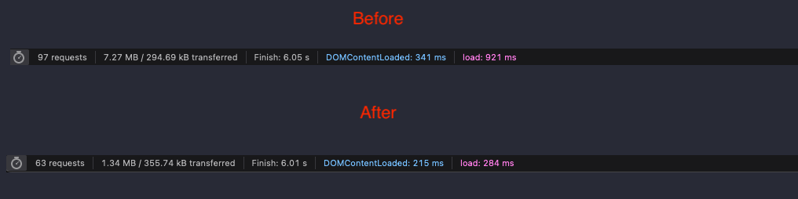

# wasm-dns-https

This is a personalized experiement on [Fastly Compute](https://www.fastly.com/products/compute) please do not actually use but rather enjoy the code example for now :D 

## How it works 

Right now the code works in the following way:

1. The request is received via a HTTPS request (`GET` or `POST`) on the edge, and following [RFC8484](https://datatracker.ietf.org/doc/html/rfc8484).
2. The compute code blocks domains found in the `blocklist.se` file and does not send the request upstream and then returns HTTP Status Code `418` because it's fun and a header that signifies `"BLOCKED"`. 
3. A domain not found in the blocklist is processed to (for now) an upstream server via HTTPS then returns to the client successfully if it exists via a forward DNS packet from the upstream Name Server (NS).

Most events are logged to a [HoneyComb](https://honeycomb.io) instance, I am especially interested in learning how to optimize this to keep resoponses low. 

### Analysis 

So far this has been working really well, I have not switched it over to my daily driver yet but here's some examples of a test site (thanks, !) and it's load times: 

As well a a full trace of the network requsts: 

## Limitations

Right now there's a couple limitations to this: 

1. I have to include the entire `blocklist.se` file for now for a couple reasons:
    a. I could not find a decent API from the [OISD](https://oisd.nl) list or anything like it, I am happy to take recommendations!
    b. It is too large to fit into the [Fastly Config Store](https://www.fastly.com/blog/introducing-config-store-storing-and-updating-configuration-data-at-the-edge), which is what I was hoping to use to increase performance.
2. I am currently using the Google API as the backend/upstream Name Server, all requests are forwarded there because their [JSON API](https://developers.google.com/speed/public-dns/docs/doh/json) is nice. 
    a. Technically if a lot of people started using this service it would be private but since this is designed for just me it does give Google a bit of information (although the end requests are coming from Fastly's Compute Network IPs) of my requests. 
3. I do not have any of their privacy perserving features but that is future work for myself. 
4. Performance has not been addressed, though I am seeing decent times (thanks Rust 🦀) this is future work. 

## Future Work 

The code is not exactly production ready, for example there's no error handling at the moment. Check in on the issues here, I plan to keep working on this until I can get it ready for use as my daily driver 😃!